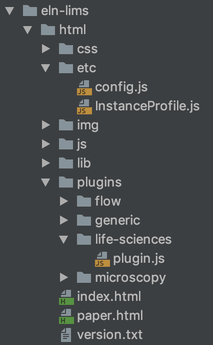

ELN-LIMS WEB UI extensions
==========================

## Introduction

The current aim of this extensions is to accommodate two groups of
modifications:

Pure Configuration, enabling/disabling some features, to clean the
interface and make it less confusing for non expert users. Very often
also to add type extensions for types specified with another master data
extension.

extending the interface to accommodate additional functionality without
needing to deal with the internals.

## Plugin structure



### plugins folder

Each folder on this folder is a ELN UI extension.

Each extension currently contains a single file with name "plugin.js".

### config.js file

Contains a section called  PLUGINS\_CONFIGURATION indicating the plugins
to be loaded from the plugins folder.

```js
    var PLUGINS_CONFIGURATION = {
        extraPlugins : ["life-sciences", "flow", "microscopy"]
    }
```

### plugin.js file

Contains the actual source of the plugin, we can distinguish three clear
sections/patterns on the skeleton of the interface:

-   Interface:
    <https://sissource.ethz.ch/sispub/openbis/-/blob/master/ui-eln-lims/src/core-plugins/eln-lims/1/as/webapps/eln-lims/html/js/config/ELNLIMSPlugin.js>

1. Configuring views through the use of a JSON structure. Part of this
structure are:

-   forcedDisableRTF (Deprecated in favour of Custom Widgets
    configurable from the Instance Settings on the UI)
-   forceMonospaceFont (Deprecated in favour of Custom Widgets
    configurable from the Instance Settings on the UI)
-   experimentTypeDefinitionsExtension
-   sampleTypeDefinitionsExtension
-   dataSetTypeDefinitionsExtension

These are used extensively since they come at a very low development
effort. Best examples of how to use these definition extensions can be
found in technologies that ship with the ELN:

-   Generic Technology:
    <https://sissource.ethz.ch/sispub/openbis/-/blob/master/ui-eln-lims/src/core-plugins/eln-lims/1/as/webapps/eln-lims/html/plugins/generic/plugin.js>
-   Life Sciences Technology:
    <https://sissource.ethz.ch/sispub/openbis/-/blob/master/ui-eln-lims/src/core-plugins/eln-lims/1/as/webapps/eln-lims/html/plugins/life-sciences/plugin.js>

2\. Extending views through the use of the [Interceptor
Pattern](https://en.wikipedia.org/wiki/Interceptor_pattern)

-   Template Methods: **ONLY** allow to add content in certain portions
    of the Interface. **ONLY** available for Experiment, Sample and
    DataSet form views. These template methods are easy to use, they
    allow to add custom components isolating the programmer from the
    rest of the form.
    -   experimentFormTop
    -   experimentFormBottom
    -   sampleFormTop
    -   dataSetFormBottom
    -   dataSetFormTop
    -   dataSetFormBottom
-   Event Listeners: Allow to listen the before/after paint events for
    **ALL** form views and list views. Allow the programmer to change
    the model before is displayed and any part of the view after.
    Provide versatility but with added complexity of dealing with the
    complete form.
    -   beforeViewPaint
    -   afterViewPaint

 

-   Template methods are only needed to add custom components to from
    views. Best examples of how to use these can be found in
    technologies that ship with the ELN:
    -   Microscopy Technology:
        <https://sissource.ethz.ch/sispub/openbis/-/blob/master/ui-eln-lims/src/core-plugins/eln-lims/1/as/webapps/eln-lims/html/plugins/microscopy/plugin.js> 

3\. Other Extensions:

-   onSampleSave: Reserved for internal use and discouraged to use. It
    is tricky to use properly.
-   getExtraUtilities: Allows to extend the utilities menu. A great
    example is this template:
    <https://sissource.ethz.ch/sispub/openbis/-/blob/master/ui-eln-lims/src/core-plugins/eln-lims/1/as/webapps/eln-lims/html/plugins/template-extra-utilities/plugin.js>

## Source Code Examples (plugin.js)

### Configuration Only Extensions

An example with only type configurations extensions is show below.

```js
    function MyTechnology() {
       this.init();
    }

    $.extend(MyTechnology.prototype, ELNLIMSPlugin.prototype, {
       init: function() {
       
       },
       experimentTypeDefinitionsExtension : {
            "FOLDER": {
                "TOOLBAR": { CREATE: false, FREEZE: false, EDIT: false, MOVE: false, DELETE: false, UPLOAD_DATASET: false, UPLOAD_DATASET_HELPER: false, EXPORT_ALL: false, EXPORT_METADATA: true }
            }
       },
       sampleTypeDefinitionsExtension : {
            "SAMPLE_TYPE" : {
                "TOOLBAR": { CREATE : true, EDIT : true, FREEZE : true, MOVE : true, COPY: true, DELETE : true, PRINT: true, HIERARCHY_GRAPH : true, HIERARCHY_TABLE : true, UPLOAD_DATASET : true, UPLOAD_DATASET_HELPER : true, EXPORT_ALL : true, EXPORT_METADATA : true, TEMPLATES : true, BARCODE : true },
                "SHOW" : false,
                "SAMPLE_CHILDREN_DISABLED": false,
                "SAMPLE_CHILDREN_ANY_TYPE_DISABLED" : false,
                "SAMPLE_PARENTS_DISABLED": false,
                "SAMPLE_PARENTS_ANY_TYPE_DISABLED": true,
                "SAMPLE_PARENTS_HINT": [{
                    "LABEL": "Parent Label",
                    "TYPE": "PARENT_TYPE",
                    "ANNOTATION_PROPERTIES": []
                }],
                "SAMPLE_CHILDREN_HINT" : [{
                    "LABEL": "Children Label",
                    "TYPE": "CHILDREN_TYPE",
                    "MIN_COUNT" : 0,
                    "ANNOTATION_PROPERTIES": [{"TYPE" : "ANNOTATION.SYSTEM.COMMENTS", "MANDATORY" : false }]
                }],
                "ENABLE_STORAGE" : false,
                "SHOW_ON_NAV": false,
                "SHOW_ON_NAV_FOR_PARENT_TYPES": undefined,
                extraToolbar : undefined
            },
       },
       dataSetTypeDefinitionsExtension : {
            "DATASET_TYPE" : {
                "TOOLBAR": { EDIT : true, FREEZE : true, MOVE : true, ARCHIVE : true, DELETE : true, HIERARCHY_TABLE : true, EXPORT_ALL : true, EXPORT_METADATA : true },
                "DATASET_PARENTS_DISABLED" : false,
                extraToolbar : undefined
            },
       }
    });

    profile.plugins.push(new MyTechnology());
```

### Toolbar Extensions

An example with only toolbar extensions is shown below, variables with a
dollar sign '$' indicate they are jquery components:

```js
    function MyTechnology() {
       this.init();
    }

    $.extend(MyTechnology.prototype, ELNLIMSPlugin.prototype, {
       init: function() {
       
       },
       sampleTypeDefinitionsExtension : {
            "SAMPLE_TYPE" : {
                extraToolbar : function(mode, sample) {
                    var toolbarModel = [];
                    if(mode === FormMode.VIEW) {
                        var $demoButton = FormUtil.getButtonWithIcon("glyphicon-heart", function () {
                            //This empty function could be a call to do something in particular
                        });
                        toolbarModel.push({ component : $demoButton, tooltip: "Demo" });
                    }
                    return toolbarModel;
                }
            },
       },
       dataSetTypeDefinitionsExtension : {
            "DATASET_TYPE" : {
                extraToolbar : function(mode, dataset) {
                    var toolbarModel = [];
                    if(mode === FormMode.VIEW) {
                        var $demoButton = FormUtil.getButtonWithIcon("glyphicon-heart", function () { 
                            //This empty function could be a call to do something in particular
                        });
                        toolbarModel.push({ component : $demoButton, tooltip: "Demo" });
                    }
                    return toolbarModel;
                }
            },
       }
    });

    profile.plugins.push(new MyTechnology());
```

### Extra Views as Utilities

Please check the provided example:
<https://sissource.ethz.ch/sispub/openbis/-/blob/master/ui-eln-lims/src/core-plugins/eln-lims/1/as/webapps/eln-lims/html/plugins/template-extra-utilities/plugin.js>
