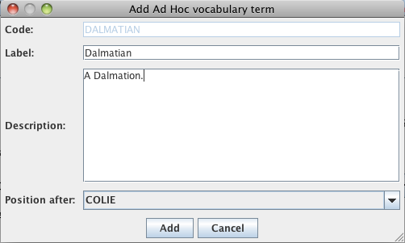
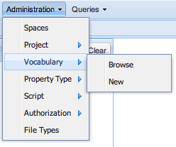
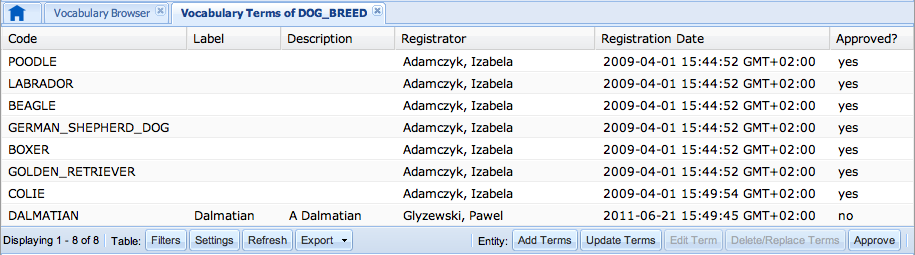

# Ad Hoc Vocabulary Terms

## Introduction

*Ad Hoc Vocabulary Term* is a special kind of Vocabulary Term. If needed
term is missing in the vocabulary, it can be added by Power User when
filling up the form.

## Creating new Ad Hoc Vocabulary Term

Ad Hoc Vocabulary Terms can be created either via web interface of
openBIS, or by DataSet Uploader. Below you can learn how to do it in
both cases.

### openBIS

When filling up the forms in openBIS, Power User will see next to the
drop down list a plus icon (see picture below).


By clicking on the icon, user can add Ad Hoc Vocabulary Term. A dialog
appears (similar to one on screenshot below), in which it is possible to
specify label, description and position on list of terms. The code will
be generated automatically from the label.


User can easily distinguish between regular, and Ad Hoc Vocabulary Term
- the second one is shown in *italic grey* (see screenshot below).


### DataSet Uploader

In DataSet Uploader the mechanism is very similar to one in openBIS.
When you want to add Ad Hoc Vocabulary Term, click on a plus button (see
picture below).


After clicking on plus button, a dialog appears (again, very similar to
on in openBIS).



Ad Hoc Vocabulary Terms can be easily recognize - they are shown in
*italic grey* (see screenshot below).


## Approving Ad Hoc Vocabulary Terms

Power User can approve Ad Hoc Vocabulary Terms. Approving changes the Ad
Hoc Term into regular one - it won't be shown in *italic grey* anymore,
the maintenance task won't be able to delete it.

To approve Ad Hoc Vocabulary Term select `Vocabulary -> Browse` from
`Administration` menu (see screenshot below).



Then select the vocabulary from the list. The new tab with all the terms
available in chosen vocabulary will be shown. In column `Approved?` you
can see weather term is Ad Hoc (not approved) or not (see the
screenshot).



You can select all the terms you want to approve (it is possible to
select more than one using command key on Mac, or control key on Windows
and Linux) and simply click on "Approve" button. You will see last
confirmation dialog before operation will be performed (see the picture
below).


## Maintenance Task

There is a maintenance task which deletes unused Ad Hoc Vocabulary Terms
older than configured number of days. It can be configured in openBIS
`service.properties`.

**service.properties**

```
# --------------------------------------------------------------------------------------------------
# Maintenance task removing old and unused Ad Hoc Vocabulary Terms
# --------------------------------------------------------------------------------------------------
# The directory to watch for incoming data.
ad-hoc-terms-remove-task.class = ch.systemsx.cisd.openbis.generic.server.task.RemoveUnusedUnofficialTermsMaintenanceTask
ad-hoc-terms-remove-task.interval = 3600
ad-hoc-terms-remove-task.older-than-days = 7
```


Make sure, that the task is configured on maintenance-plugins list.

## Configuration

By default, Ad Hoc Vocabulary Terms are disabled. To enable it, you have
to edit `web-client.properties` of openBIS and set
`allow-adding-unofficial-terms` property to `true`.

**web-client.properties**

```
# Should the feature of adding unofficial/ad-hoc terms to vocabularies be turned on.
# Default value: false 
allow-adding-unofficial-terms = true
```


You should make sure, that in openBIS `service.properties` file you have
specified path `web-client.properties` file.

**service.properties**

```
# Name of the file that stores Web Client configuration
web-client-configuration-file = etc/web-client.properties
```
