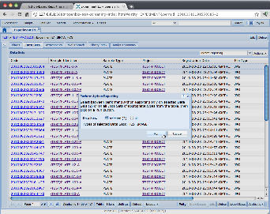

# Jython-based Reporting and Processing Plugins

## Overview

It is possible to implement logic of reporting and processing plugins as
Jython scripts instead of providing new classes implementing
`IReportingPluginTask` and `IProcessingPluginTask` Java interfaces.

The scripts require only a single method to be implemented and have
access to a few services that simplify tasks such as data retrieval,
creation of tables or sending emails:

-   access to files of a data set is done via
    [IHierarchicalContent](https://openbis.ch/javadoc/20.10.x/javadoc-openbis-common/ch/systemsx/cisd/openbis/common/io/hierarchical_content/api/IHierarchicalContent.html)
    interface (through
    [IDataSet.getContent()](https://openbis.ch/javadoc/20.10.x/javadoc-datastore-server/ch/systemsx/cisd/openbis/dss/generic/server/plugins/jython/api/IDataSet.html#getContent%28%29))
-   access to openBIS AS via
    [ISearchService](https://openbis.ch/javadoc/20.10.x/javadoc-datastore-server/ch/systemsx/cisd/openbis/dss/generic/shared/api/internal/v2/ISearchService.html)
    (through `searchService` and `searchServiceUnfiltered` variables),
-   access to data sources specified in DSS via
    [IDataSourceQueryService](https://openbis.ch/javadoc/20.10.x/javadoc-datastore-server/ch/systemsx/cisd/openbis/dss/generic/shared/api/internal/IDataSourceQueryService.html)
    (through `queryService` variable),
-   creation of tables in reporting script via
    [ISimpleTableModelBuilderAdaptor](https://openbis.ch/javadoc/20.10.x/javadoc-openbis/ch/systemsx/cisd/openbis/generic/shared/managed_property/api/ISimpleTableModelBuilderAdaptor.html)
    (provided as a function argument),
-   sending emails via
    [IMailService](https://openbis.ch/javadoc/20.10.x/javadoc-datastore-server/ch/systemsx/cisd/openbis/dss/generic/server/plugins/jython/api/IMailService.html)
    (through `mailService`variable)  
    -   it is easy to send a file or a text as an attachment to the user
        (subject and text body can be provided optionally)
    -   it is also possible to use a reporting script as a processing
        plugin sending the report as an attachment to the user
-   checking user access privileges via the
    [IAuthorizationService](https://openbis.ch/javadoc/20.10.x/javadoc-datastore-server/ch/systemsx/cisd/openbis/dss/generic/shared/api/internal/v2/authorization/IAuthorizationService.html)
      
     (available from the `authorizationService` variable).

All jython plugins use Jython version configured by the
service.properties property `jython-version` which can be either 2.5 or
2.7.

## Configuration

Jython-based plugins are configured in exactly the same way as other
reporting and processing plugins. Apart from standard mandatory plugin
properties one needs to specify a path to the script - `script-path`.

Additional third-party JAR files have to be added to the core plugin in
a sub-folder `lib/`.

Here are some configuration examples for core plugins of the type
reporting-plugins and processing-plugins, respectively:

#### Jython-based Reporting Plugin

**plugin.properties**

```
label = Jython Reporting
dataset-types = HCS_IMAGE
class = ch.systemsx.cisd.openbis.dss.generic.server.plugins.jython.JythonBasedReportingPlugin
script-path = data-set-reporting.py
```


#### Jython Aggregation Service 

**plugin.properties**

```
label = Jython Aggregation Reporting
class = ch.systemsx.cisd.openbis.dss.generic.server.plugins.jython.JythonAggregationService
script-path = aggregating.py
```


#### Jython Ingestion Service

**plugin.properties**

```
label = Jython Aggregation Reporting
class = ch.systemsx.cisd.openbis.dss.generic.server.plugins.jython.JythonIngestionService
script-path = processing.py
```

Note, that property dataset-types is not needed and will be ignored.

#### Jython-based Processing Plugin

**plugin.properties**

```
label = Jython Processisng
dataset-types = HCS_IMAGE
class = ch.systemsx.cisd.openbis.dss.generic.server.plugins.jython.JythonBasedProcessingPlugin
script-path = data-set-processing.py
```


#### Processing Plugin based on Reporting Script

One can also configure a special processing plugin
(`ch.systemsx.cisd.openbis.dss.generic.server.plugins.jython.ReportingBasedProcessingPlugin`)
which uses a reporting script instead of processing script. The
reporting script's task is as usual - to describe contents of a table.
The processing plugin will then convert the generated table to a text
form and send it in an email as an attachment. This feature facilitates
code reuse - one can write one script and use it for both reporting and
processing plugins.

Configuration of the plugin is as simple as the one for basic
jython-based plugins with a few additional properties for specifying
email content:

**service.properties**

```
...

# --------------------------------------------------------------------------------------------------
# Jython-based Processing Plugin based on Reporting Script
# --------------------------------------------------------------------------------------------------
jython-processing-with-report.label = Jython Processing based on Reporting Script
jython-processing-with-report.dataset-types = HCS_IMAGE
jython-processing-with-report.class = ch.systemsx.cisd.openbis.dss.generic.server.plugins.jython.ReportingBasedProcessingPlugin
jython-processing-with-report.script-path = /resource/examples/data-set-reporting.py
# Optional properties:
# - subject of the email with generated report;
#   defaults to empty subject
#jython-processing-with-report.email-subject = Report
# - body of the email with generated report -
#   defaults to empty subject
#jython-processing-with-report.email-body = The report was successfuly generated and is attached to this email.
# - name of the attachment with generated report;
#   defaults to 'report.txt'
#jython-processing-with-report.attachment-name = report-attachment.txt
# - whether there should be a single report for all processed data sets generated and send in an email to the user,
#   or rather should it be done for processed every data set separately (with one report & email per data set);
#   defaults to false
#jython-processing-with-report.single-report = true

...
```


Sending an email directly in a processing script is more flexible in
defining content of the email than what is described above. It might be
preferable if one wants to decide on the email's subject, body or
attachment name dynamically, based e.g. on metadata.

## Script interfaces and environment

#### Reporting script

The script file (e.g. "data-set-reporting.py") needs to implement one
method:

`describe(dataSets, tableBuilder)`

which takes a list of data sets (implementing
[IDataSet](https://openbis.ch/javadoc/20.10.x/javadoc-datastore-server/ch/systemsx/cisd/openbis/dss/generic/server/plugins/jython/api/IDataSet.html)
interface) and a table builder
([ISimpleTableModelBuilderAdaptor](https://openbis.ch/javadoc/20.10.x/javadoc-openbis/ch/systemsx/cisd/openbis/generic/shared/managed_property/api/ISimpleTableModelBuilderAdaptor.html))
that will be used to generate the table shown in openBIS AS or sent in
an email. The method shouldn't return anything. Instead one should call
methods of the table builder and a the table model will be created
outside of the script using the builder.

#### Aggregation Service script

The script file (e.g. "aggregating.py") needs to implement one method:

`aggregate(parameters, tableBuilder)`

which takes some parameters (a java.util.Map with String keys and
generic Object values) and a table builder
([ISimpleTableModelBuilderAdaptor](https://openbis.ch/javadoc/20.10.x/javadoc-openbis/ch/systemsx/cisd/openbis/generic/shared/managed_property/api/ISimpleTableModelBuilderAdaptor.html))
that will be used to generate the table shown in openBIS AS or sent in
an email. The method shouldn't return anything. Instead one should call
methods of the table builder and a the table model will be created
outside of the script using the builder.

#### Ingestion Service script

The script file (e.g. "processing.py") needs to implement one method:

`process(transaction, parameters, tableBuilder)`

which takes a transaction, some parameters (a java.util.Map with String
keys and generic Object values) and a table builder
([ISimpleTableModelBuilderAdaptor](https://openbis.ch/javadoc/20.10.x/javadoc-openbis/ch/systemsx/cisd/openbis/generic/shared/managed_property/api/ISimpleTableModelBuilderAdaptor.html))
that will be used to generate the table shown in openBIS AS or sent in
an email. The method shouldn't return anything. Instead one should call
methods of the table builder and a the table model will be created
outside of the script using the builder. The transaction interface is
the same as what is provided to a dropbox.
See [Dropboxes](../software-developer-documentation/server-side-extensions/dss-dropboxes.md) for a description of
what can be done with a transaction.

#### Processing script

The script file (e.g. "data-set-processing.py") needs to implement one
method:

`process(dataSet)`

which takes a single data set (implementing
[IDataSet](https://openbis.ch/javadoc/20.10.x/javadoc-datastore-server/ch/systemsx/cisd/openbis/dss/generic/server/plugins/jython/api/IDataSet.html)
interface). The method shouldn't return anything.

#### Environment

Both Processing and Reporting script functions are invoked in an
environment with following services available as global variables:

|Variable Name|Service Interface|Description|
|--- |--- |--- |
|searchService|ISearchService|Methods for listing entities from openBIS AS filtered to those visible to the user.|
|searchServiceUnfiltered|ISearchService|As above, but unfiltered|
|queryService|IDataSourceQueryService|Methods for querying external databases specified in DSS|
|mailService|IMailService|Methods for sending emails with an attachment to the user who triggered reporting/processing|
|contentProvider|IDataSetContentProvider|Has a method for retrieving a IHierarchicalContent for a specified data set code, filtered to data visible by user.|
|contentProviderUnfiltered|IDataSetContentProvider|Has a method for retrieving a IHierarchicalContent for a specified data set code, unfiltered.|
|authorizationService|IAuthorizationService|Methods for determining user access privileges and filter entities to those visible to the user.|
|userId|String|The id of the user who requested this report (supposed to be used for authorization)|


From method arguments one can:

-   retrieve basic metadata information about data set and access its
    files through object implementing
    [IHierarchicalContent](https://openbis.ch/javadoc/20.10.x/javadoc-openbis-common/ch/systemsx/cisd/openbis/common/io/hierarchical_content/api/IHierarchicalContent.html)
    (received by calling
    [IDataSet.getContent()](https://openbis.ch/javadoc/20.10.x/javadoc-datastore-server/ch/systemsx/cisd/openbis/dss/generic/server/plugins/jython/api/IDataSet.html#getContent%28%29)),
-   (reporting script) build contents of a table using
    `ISimpleTableModelBuilderAdaptor`,

## Example scripts

#### Simple reporting plugin

```py
CODE = "Code"
TYPE = "Type"
SIZE = "Size"
LOCATION = "Location"
SPEED_HINT = "Speed Hint"
MAIN_PATTERN = "Main Data Set Pattern"
MAIN_PATH = "Main Data Set Path"
INSTANCE = "Instance"
SPACE = "Space"
PROJECT = "Project"
EXPERIMENT_CODE = "Experiment Code"
EXPERIMENT_IDENTIFIER = "Experiment Identifier"
EXPERIMENT_TYPE = "Experiment Type"
SAMPLE_CODE = "Sample Code"
SAMPLE_IDENTIFIER = "Sample Identifier"
SAMPLE_TYPE = "Sample Type"

def describe(dataSets, tableBuilder):

    tableBuilder.addHeader(CODE)
    tableBuilder.addHeader(TYPE)
    tableBuilder.addHeader(SIZE)
    tableBuilder.addHeader(LOCATION)
    tableBuilder.addHeader(SPEED_HINT)
    tableBuilder.addHeader(MAIN_PATTERN)
    tableBuilder.addHeader(MAIN_PATH)
    tableBuilder.addHeader(INSTANCE)
    tableBuilder.addHeader(SPACE)
    tableBuilder.addHeader(PROJECT)
    tableBuilder.addHeader(EXPERIMENT_CODE)
    tableBuilder.addHeader(EXPERIMENT_IDENTIFIER)
    tableBuilder.addHeader(EXPERIMENT_TYPE)
    tableBuilder.addHeader(SAMPLE_CODE)
    tableBuilder.addHeader(SAMPLE_IDENTIFIER)
    tableBuilder.addHeader(SAMPLE_TYPE)

    for dataSet in dataSets:
        print "script reporting " + dataSet.getDataSetCode()

        row = tableBuilder.addRow()
        row.setCell(CODE, dataSet.getDataSetCode())
        row.setCell(TYPE, dataSet.getDataSetTypeCode())
        row.setCell(SIZE, dataSet.getDataSetSize())
        row.setCell(LOCATION, dataSet.getDataSetLocation())
        row.setCell(SPEED_HINT, dataSet.getSpeedHint())
        row.setCell(MAIN_PATTERN, dataSet.getMainDataSetPattern())
        row.setCell(MAIN_PATH, dataSet.getMainDataSetPath())
        row.setCell(INSTANCE, dataSet.getInstanceCode())
        row.setCell(SPACE, dataSet.getSpaceCode())
        row.setCell(PROJECT, dataSet.getProjectCode())
        row.setCell(EXPERIMENT_CODE, dataSet.getExperimentCode())
        row.setCell(EXPERIMENT_IDENTIFIER, dataSet.getExperimentIdentifier())
        row.setCell(EXPERIMENT_TYPE, dataSet.getExperimentTypeCode())
        row.setCell(SAMPLE_CODE, dataSet.getSampleCode())
        row.setCell(SAMPLE_IDENTIFIER, dataSet.getSampleIdentifier())
        row.setCell(SAMPLE_TYPE, dataSet.getSampleTypeCode())
```


#### Reporting plugin accessing openBIS AS

```py
CODE = "Data Set Code"
EXPERIMENT_IDENTIFIER = "Experiment Identifier"
EXPERIMENT_TYPE = "Experiment Type"
EXPERIMENT_DESCRIPTION = "Description"

def describe(dataSets, tableBuilder):

    tableBuilder.addHeader(CODE)
    tableBuilder.addHeader(EXPERIMENT_IDENTIFIER)
    tableBuilder.addHeader(EXPERIMENT_TYPE)
    tableBuilder.addHeader(EXPERIMENT_DESCRIPTION)

    for dataSet in dataSets:
        projectIdentifier = "/" + dataSet.getSpaceCode() + "/" + dataSet.getProjectCode()
        print "script reporting " + dataSet.getDataSetCode() + " from " + projectIdentifier
        experiments = searchService.listExperiments(projectIdentifier)

        for experiment in experiments:
            row = tableBuilder.addRow()
            row.setCell(CODE, dataSet.getDataSetCode())
            row.setCell(EXPERIMENT_IDENTIFIER, experiment.getExperimentIdentifier())
            row.setCell(EXPERIMENT_TYPE, experiment.getExperimentType())
            row.setCell(EXPERIMENT_DESCRIPTION, experiment.getPropertyValue("DESCRIPTION"))
```


#### Reporting plugin accessing external DB

Lets assume that a [Path Info Database](https://unlimited.ethz.ch/display/openBISDoc2010/Installation+and+Administrators+Guide+of+the+openBIS+Data+Store+Server#InstallationandAdministratorsGuideoftheopenBISDataStoreServer-InstallationandAdministratorsGuideoftheopenBISDataStoreServer-PathInfoDatabase)
was configured as a data source named `"path-info-db"`.

One shouldn't assume anything about Path Info DB schema. Code below
should serve just as an example of accessing an external DB in a jython
reporting/processing script.

```py
DATA_SOURCE = "path-info-db"
QUERY = """
    SELECT ds.code as "data_set_code", dsf.*
    FROM data_sets ds, data_set_files dsf
    WHERE ds.code = ?{1} AND dsf.dase_id = ds.id
"""

"""reporting table column names"""
DATA_SET_CODE = "Data Set"
RELATIVE_PATH = "Relative Path"
FILE_NAME = "File Name"
SIZE_IN_BYTES = "Size"
IS_DIRECTORY = "Is Directory?"
LAST_MODIFIED = "Last Modified"

def describe(dataSets, tableBuilder):

    tableBuilder.addHeader(DATA_SET_CODE)
    tableBuilder.addHeader(RELATIVE_PATH)
    tableBuilder.addHeader(FILE_NAME)
    tableBuilder.addHeader(SIZE_IN_BYTES)
    tableBuilder.addHeader(IS_DIRECTORY)
    tableBuilder.addHeader(LAST_MODIFIED)

    for dataSet in dataSets:
        results = queryService.select(DATA_SOURCE, QUERY, [dataSet.getDataSetCode()])
        print "Found " + str(len(results)) + " results for data set '" + dataSet.getDataSetCode() + "':"
        for r in results:
            print r # debugging
            row = tableBuilder.addRow()
            row.setCell(DATA_SET_CODE, r.get("DATA_SET_CODE".lower()))
            row.setCell(RELATIVE_PATH, r.get("RELATIVE_PATH".lower()))
            row.setCell(FILE_NAME, r.get("FILE_NAME".lower()))
            row.setCell(SIZE_IN_BYTES, r.get("SIZE_IN_BYTES".lower()))
            row.setCell(IS_DIRECTORY, r.get("IS_DIRECTORY".lower()))
            row.setCell(LAST_MODIFIED, r.get("LAST_MODIFIED".lower()))
        results.close()
```


#### Reporting plugin accessing file contents

```py
import java.util.Date as Date

CODE = "Code"
FILE_NAME = "File Name"
RELATIVE_PATH = "Relative Path"
LAST_MODIFIED = "Last Modified"
SIZE = "Size"

def describe(dataSets, tableBuilder):
    tableBuilder.addHeader(CODE)
    tableBuilder.addHeader(FILE_NAME)
    tableBuilder.addHeader(RELATIVE_PATH)
    tableBuilder.addHeader(LAST_MODIFIED)
    tableBuilder.addHeader(SIZE)
    for dataSet in dataSets:
        print "script reporting " + dataSet.getDataSetCode()
        describeNode(dataSet.getContent().getRootNode(), dataSet.getDataSetCode(), tableBuilder)


def describeNode(node, dataSetCode, tableBuilder):
    print "describe node: " + dataSetCode + "/" + node.getRelativePath()
    if node.isDirectory():
        for child in node.getChildNodes():
            describeNode(child, dataSetCode, tableBuilder)
    else:
        row = tableBuilder.addRow()
        row.setCell(CODE, dataSetCode)
        row.setCell(FILE_NAME, node.getName())
        row.setCell(RELATIVE_PATH, node.getRelativePath())
        row.setCell(LAST_MODIFIED, Date(node.getLastModified()))
        row.setCell(SIZE, node.getFileLength())
```

#### Aggregation Service Reporting plugin accessing openBIS, external database and file contents

```py
from ch.systemsx.cisd.openbis.generic.shared.api.v1.dto import SearchCriteria
from ch.systemsx.cisd.openbis.generic.shared.api.v1.dto import SearchSubCriteria
from ch.systemsx.cisd.openbis.generic.shared.api.v1.dto.SearchCriteria import MatchClause
from ch.systemsx.cisd.openbis.generic.shared.api.v1.dto.SearchCriteria import MatchClauseAttribute

EXPERIMENT = "Experiment"
CODE = "Data Set Code"
NUMBER_OF_FILES = "Number of Files"
NUMBER_OF_PROTEINS = "Number of Proteins"

def countFiles(node):
    sum = 1
    if node.isDirectory():
        for child in node.getChildNodes():
            sum = sum + countFiles(child)
    return sum

def getNumberOfProteins(dataSetCode):
    result = queryService.select("protein-db", "select count(*) as count from proteins where data_set = ?{1}", [dataSetCode])
    return result[0].get("count")

def aggregate(parameters, tableBuilder):
    experimentCode = parameters.get('experiment-code')
    searchCriteria = SearchCriteria()
    subCriteria = SearchCriteria()
    subCriteria.addMatchClause(MatchClause.createAttributeMatch(MatchClauseAttribute.CODE, experimentCode))
    searchCriteria.addSubCriteria(SearchSubCriteria.createExperimentCriteria(subCriteria))
    dataSets = searchService.searchForDataSets(searchCriteria)
    tableBuilder.addHeader(EXPERIMENT)
    tableBuilder.addHeader(CODE)
    tableBuilder.addHeader(NUMBER_OF_FILES)
    tableBuilder.addHeader(NUMBER_OF_PROTEINS)
    for dataSet in dataSets:
        dataSetCode = dataSet.getDataSetCode()
        content = contentProvider.getContent(dataSetCode)
        row = tableBuilder.addRow()
        row.setCell(EXPERIMENT, dataSet.experiment.experimentIdentifier)
        row.setCell(CODE, dataSetCode)
        row.setCell(NUMBER_OF_FILES, countFiles(content.rootNode))
        row.setCell(NUMBER_OF_PROTEINS, getNumberOfProteins(dataSetCode))
```


#### Simple processing plugin

```py
import org.apache.commons.io.IOUtils as IOUtils

def process(dataSet):
    dataSetCode = dataSet.getDataSetCode()
    print "script processing " + dataSetCode
    processNode(dataSet.getContent().getRootNode(), dataSet.getDataSetCode())

def processNode(node, dataSetCode):
    print "process node: " + dataSetCode + "/" + node.getRelativePath()
    if node.isDirectory():
        for child in node.getChildNodes():
            processNode(child, dataSetCode)
    else:
        print "content (" + str(node.getFileLength()) + "): " + \
                IOUtils.readLines(node.getInputStream()).toString()
```

#### Processing plugin sending emails

```py
import org.apache.commons.io.IOUtils as IOUtils

def process(dataSet):
    dataSetCode = dataSet.getDataSetCode()
    print "script processing " + dataSetCode
    processNode(dataSet.getContent().getRootNode(), dataSet.getDataSetCode())

def processNode(node, dataSetCode):
    print "process node: " + dataSetCode + "/" + node.getRelativePath()
    if node.isDirectory():
        for child in node.getChildNodes():
            processNode(child, dataSetCode)
    else:
        fileAsString = IOUtils.readLines(node.getInputStream()).toString()
        fileName = node.getName()

        if fileName.endswith(".txt"):
            mailService.createEmailSender().\
                withSubject("processed text file " + fileName).\
                withBody("see the attached file").\
                withAttachedText(fileAsString, fileName).\
                send()
        else:
            filePath = node.getFile().getPath()
            mailService.createEmailSender().\
                withSubject("processed file " + fileName).\
                withBody("see the attached file").\
                withAttachedFile(filePath, fileName).\
                send()
```

#### Example of Webapps that interact with Aggregation and Ingestion services

[Webapps and Services](https://unlimited.ethz.ch/display/openBISDoc2010/Webapps+and+Services)

## Screening Extensions

For each of the above processing plugins, there is a screening variant
that makes the
[IScreeningOpenbisServiceFacade](https://openbis.ch/javadoc/20.10.x/javadoc-screening-api/ch/systemsx/cisd/openbis/plugin/screening/client/api/v1/IScreeningOpenbisServiceFacade.html)
available to plugins. If you need access to the services it provides,
use the screening variant.

|Variable Name|Service Interface|Description|
|--- |--- |--- |
|searchService|ISearchService|Methods for listing entities from openBIS AS filtered to those visible to the user.|
|searchServiceUnfiltered|ISearchService|As above, but unfiltered|
|queryService|IDataSourceQueryService|Methods for querying external databases specified in DSS|
|mailService|IMailService|Methods for sending emails with an attachment to the user who triggered reporting/processing|
|contentProvider|IDataSetContentProvider|Has a method for retrieving a IHierarchicalContent for a specified data set code, filtered to data visible by user.|
|contentProviderUnfiltered|IDataSetContentProvider|Has a method for retrieving a IHierarchicalContent for a specified data set code, unfiltered.|
|authorizationService|IAuthorizationService|Methods for determining user access privileges and filter entities to those visible to the user.|
|userId|String|The id of the user who requested this report (supposed to be used for authorization)|

In each case, an additional variable, *screeningFacade* is made
available to the script.

|Variable|Type|
|--- |--- |
|screeningFacade|IScreeningOpenbisServiceFacade|

## Reporting Plugin Example

An example that uses the service facade to determine the mapping from
wells to materials.

```py
"""A reporting plugin that displays a table of plate wells with their materials."""

from ch.systemsx.cisd.openbis.plugin.screening.shared.api.v1.dto import PlateIdentifier
import java.util

# The columns -- these are used both for the column headers and putting data into the table
PLATE = "Plate"
ROW = "Row"
COL = "Col"
MATERIALS_COUNT = "Number of Materials"
MATERIALS = "Materials"

# The sample type we are interested in
PLATE_SAMPLE_TYPE = "PLATE"

def getPlatesToQueryFromDataSets(dataSets):
    """Given a collection of data sets, return a list of the plates they are associated with"""
    platesToQuery = []
    for dataSet in dataSets:
    if dataSet.getSampleTypeCode() == PLATE_SAMPLE_TYPE:
        platesToQuery.append(PlateIdentifier.createFromAugmentedCode(dataSet.getSampleIdentifier()))
    return platesToQuery

def displayStringForMaterials(materials):
    """Convert a collection of materials into a string we can show the user."""
    elements = []
    for material in materials:
    elements.append(material.getAugmentedCode())
    return ", ".join(elements)

def addHeadersToTable(tableBuilder):
    """Set the table headers"""
    tableBuilder.addHeader(PLATE)
    tableBuilder.addHeader(ROW)
    tableBuilder.addHeader(COL)
    tableBuilder.addHeader(MATERIALS_COUNT)
    tableBuilder.addHeader(MATERIALS)

def addDataRowToTable(tableBuilder, mapping, row, col):
    """For each well, show the materials it refers to."""
    tableRow = tableBuilder.addRow()
    tableRow.setCell(PLATE, mapping.getPlateIdentifier().getAugmentedCode())
    tableRow.setCell(ROW, row)
    tableRow.setCell(COL, col)
    materials = mapping.getMaterialsForWell(row, col)
    tableRow.setCell(MATERIALS_COUNT, materials.size())
    tableRow.setCell(MATERIALS, displayStringForMaterials(materials))

def describe(dataSets, tableBuilder):
    """Show a table displaying the mapping from wells to materials."""
    platesToQuery = getPlatesToQueryFromDataSets(dataSets)

    # Need to convert any arguments that are jython objects to normal Java objects
    plateWellMappings = screeningFacade.listPlateMaterialMapping(java.util.ArrayList(platesToQuery), None)

    addHeadersToTable(tableBuilder)

    # Add the data to the table
    for mapping in plateWellMappings:
    width = mapping.getPlateGeometry().getWidth()
    height = mapping.getPlateGeometry().getHeight()
    for y in range(1, height + 1):
        for x in range(1, width + 1):
        addDataRowToTable(tableBuilder, mapping, y, x)
```


## Invoking Reporting and Processing Plugins

Reporting and processing plugins run against data sets. They are thus
made available from data set tables. To run a reporting plugin, simply
pick it from the drop-down box (see screenshots below). To run a
processing plugin, pick it from the "Actions" button. Optionally, one
can select data sets in the table to run the plugin against just the
selected data sets.

Aggregation service reporting plugins do not run against data sets. They
can only be invoked via Query API.

### Selecting Data Sets

  


### Selecting a Reporting Plugin


### Viewing the results


