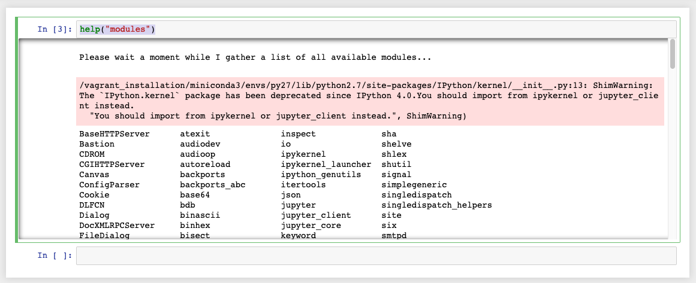
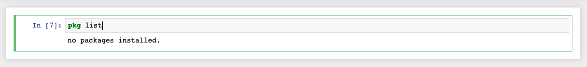
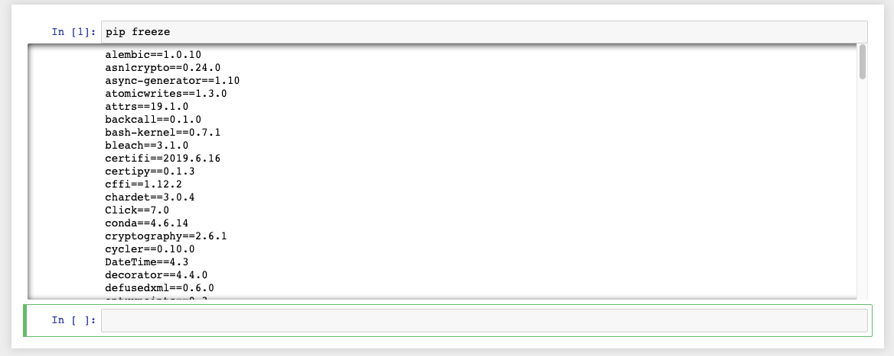
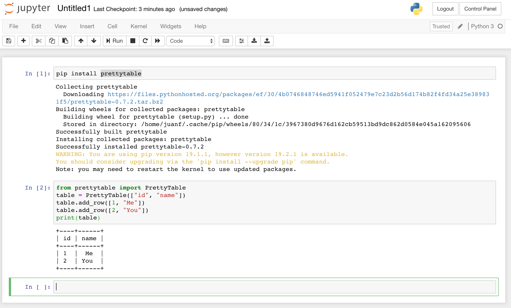
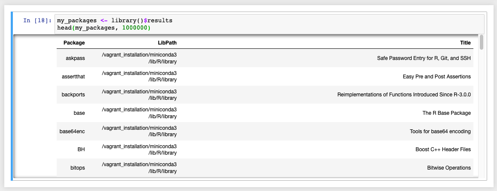
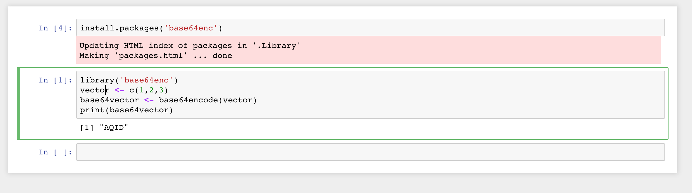
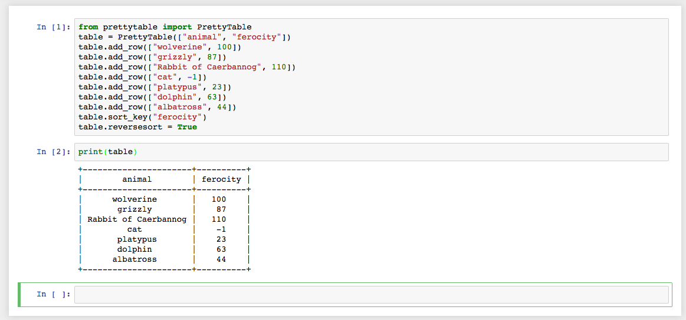
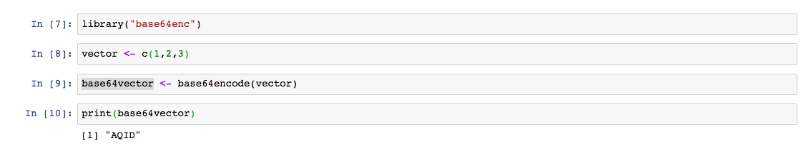
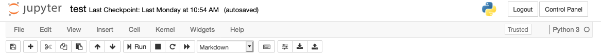

JupyterHub for openBIS
======================

```{warning}
This guide is not meant to substitute the official Docker documentation. Standard Docker commands are present in sections that are not necessarily related with them.
```

## Overview

SIS provides a Docker image for the installation of a JupyterHub server,
available at <https://hub.docker.com/r/openbis/>.

This guide explains how to modify JupyterHub docker images and save
them. It is aimed at users who are not familiar with Docker, but it
should not be considered a substitute of the official Docker
documentation.

```{warning}
We advise non expert users, to first test the instructions provided in this guide on their local machine, to familiarise themselves with the process, before making changes on the JupyterHub server.
```

Docker images are stateless, which means that after rebooting all
changes made will not be saved. This guarantees a stable environment,
which is particularly desirable to run services.

If a user wants to introduce changes, the docker image needs to be
updated. There are two possibilities for this: 

-   **For testing**: Login into the Docker container, modify it and save
    the modified container as a new image. This method is not
    recommended for production because it is not compatible with
    official JupyterHub Docker image upgrades released by SIS.
-   **For correct maintenance**: Extend the current image using a Docker
    recipe that includes only your changes. This method is recommended
    for production, because when a new official JupyterHub Docker image
    is released by SIS, it will be possible to quickly apply the changes
    to this image from the Docker recipe.

### Nomenclature

**Docker**: A computer program that performs operating-system-level
virtualisation also known as containerisation. The official website can
be found here <https://www.docker.com/>.

**Docker image**: Docker images describe the environment to virtualise.
Docker images are stateless.

**Docker container**: Docker containers provide the environment to
execute the images.

### Prerequisites for testing in a local environment

1.  **Docker environment**. All examples shown below require a working
    docker environment. Please visit <https://www.docker.com> to
    download the Docker Community Edition for your OS.
2.  **JupyterHub Docker image**. The jupyterhub-openbis images can be
    found at <https://hub.docker.com/r/openbis/>. They can be installed
    locally like any other Docker Hub image.
3.  **openBIS installation** (optional).

How to run the official JupyterHub for openBIS image in your local machine
--------------------------------------------------------------------------

1. After downloading the jupyterhub-openbis, find the id of your image.

```shell
$ docker images
REPOSITORY                                              TAG                 IMAGE ID            CREATED             SIZE
openbis/jupyterhub-openbis-sis-20180405                 latest              585a9adf333b        23 hours ago        4.75GB
```

2. Run the image with one of the two following commands:

a. if you want to connect to your productive openBIS instance (e.g.
https://openbis-elnlims.ch), use the following command:

    docker run -e OPENBIS_URL=https://openbis-elnlims.ch -e JUPYTERHUB_INTEGRATION_SERVICE_PORT=8002 -e JUPYTERHUB_PORT=8000 -e CERTIFICATE_KEY=/vagrant/config/certificates/default.key -e CERTIFICATE_CRT=/vagrant/config/certificates/default.crt -p 8000:8000 -p 8081:8081 -p 8001:8001 -p 8002:8002 585a9adf333b ./vagrant/initialize/start_jupyterhub.sh

b. if you have a local openBIS installation for testing, you can run
the following command:

    docker run -v /Users/juanf/jupyterhub-local/home:/home -v /Users/juanf/jupyterhub-local/config/certificates:/vagrant/config/certificates -e OPENBIS_URL=https://129.132.228.42:8443 -e JUPYTERHUB_INTEGRATION_SERVICE_PORT=8002 -e JUPYTERHUB_PORT=8000 -e CERTIFICATE_KEY=/vagrant/config/certificates/default.key -e CERTIFICATE_CRT=/vagrant/config/certificates/default.crt -p 8000:8000 -p 8081:8081 -p 8001:8001 -p 8002:8002 585a9adf333b ./vagrant/initialize/start_jupyterhub.sh

```{warning}
**Please note the following configuration options:**
1. -v /Users/juanf/jupyterhub-local/home:/home
This option is only required if you want to store the changes you are making. You need to have a home directory for this. It is not necessary for testing, as the image will provide a default one. This directory should contain a "vagrant" sub directory.
2. -v /Users/juanf/jupyterhub-local/config/certificates:/vagrant/config/certificates
This option is only required in production environments where you need valid certificates. It is not necssary for testing, as the image will provide a default one.
3. OPENBIS_URL= https://129.132.228.42:8443
By defaut docker is in bridge mode, which means that your docker container accesses your local machine network directly through it. If you have a local openBIS installation please use your IP address; if you use a server installation use the typical address you use to access it.
```

To stop a running docker container, run "**docker kill container\_ID"**.

The container\_ID can be found by running the command **"docker ps"**.

How to extend the official JupyterHub for openBIS image
-------------------------------------------------------

Modify a currently running container - From UI (for users)
----------------------------------------------------------

Please note that libraries installed in this way are NOT permanently
saved. After upgrade of the image, the libraries need to be
re-installed.

### Check Available Python 2 Libraries

    help("modules")



### Add Python 2 Library

It can probably be done but we are currently not supporting it.

### Check Available Octave Libraries

```shell
pkg list
```



### Add Octave Library

It can probably be done but we are currently not supporting it.

### Check Available Python 3 Libraries

```shell
pip freeze
```



### Add Python 3 Library

1. Use pip install as you would normally do. The Python 3 kernel often
doesn't need to be restarted to pick up new libraries, but is
recommended to do so.



### Check Available R Libraries

```python
my_packages <- library()$results
head(my_packages, 1000000)
```



### Add R Library

1. Use the install command as you would normally do. The R kernel needs
to be restarted to pick up new libraries.



Modify a currently running container - From Console (for admins)
----------------------------------------------------------------

1. Find the container id of the image currently running.

```shell
$ docker ps
CONTAINER ID        IMAGE                               COMMAND                  CREATED             STATUS              PORTS                                                      NAMES
a2b76d1dd204        jupyterhub-openbis-sis-20180405   "./vagrant/initial..."   4 seconds ago       Up 2 seconds        0.0.0.0:8000-8002->8000-8002/tcp, 0.0.0.0:8081->8081/tcp   nervous_leakey
```

2. Log into the container.

```shell
$ docker exec -it a2b76d1dd204 shell
```

### Add Python Library

Add a new library to Python 3

```shell
# First we should move to the environment used by JupyterHub
[root@a2b76d1dd204 /]# export PATH=/vagrant_installation/miniconda3/bin:$PATH
[root@a2b76d1dd204 /]# export LC_ALL=en_US.utf8
[root@a2b76d1dd204 /]# export LANG=en_US.utf8
# Install a new python lib using pip
[root@a2b76d1dd204 /]# python --version
Python 3.6.4 :: Anaconda, Inc.
[root@a2b76d1dd204 /]# pip install prettytable
```

This type of changes can be validated straightaway in JupyterHub, by
just starting a Python 3 notebook. Other changes could require to reboot
JupyterHub.



Please note that this approach should only be used for testing. To
preserve the changes, the running container should be saved as a new
image, otherwise when the container is shutdown these changes will be
lost.

### Add R Library

Add a new library to R

```shell
# First we should move to the environment used by JupyterHub
[root@a2b76d1dd204 /]# export PATH=/vagrant_installation/miniconda3/bin:$PATH
[root@a2b76d1dd204 /]# export LC_ALL=en_US.utf8
[root@a2b76d1dd204 /]# export LANG=en_US.utf8
# Install a new r lib using conda
[root@a2b76d1dd204 /]# sudo conda list r-
[root@a2b76d1dd204 /]# sudo conda install -c r -y r-base64enc
```

This type of changes can be validated straightaway in JupyterHub, by
just starting a R notebook. Other changes could require to reboot
JupyterHub.



### Save the state of a running container as a new image 

If you know that you have made significant changes that you want to keep
until you build a new docker recipe, you have the option to save the
running container as a new image. 


```shell
bs-mbpr28:jupyterhub_reference_installation juanf$ docker ps
CONTAINER ID        IMAGE                             COMMAND                  CREATED             STATUS              PORTS                                                      NAMES
a2b76d1dd204        jupyterhub-openbis-sis-20180405   "./vagrant/initial..."   37 minutes ago      Up 37 minutes       0.0.0.0:8000-8002->8000-8002/tcp, 0.0.0.0:8081->8081/tcp   lucid_stonebraker

$ docker commit a2b76d1dd204 jupyterhub-openbis-sis-juanextensions-20180406
sha256:5dd0036664c75a21d6a62b80bf5780e70fcad345bb12a7ad248d01e29a3caa99
$ docker images
REPOSITORY                                       TAG                 IMAGE ID            CREATED             SIZE
jupyterhub-openbis-sis-juanextensions-20180406   latest              5dd0036664c7        4 seconds ago       4.75GB
jupyterhub-openbis-sis-20180405                  latest              585a9adf333b        23 hours ago        4.75GB
```


Extend a docker image using a docker recipe (for maintenance)
-------------------------------------------------------------

The recommended approach for maintenance purposes is to extend the
latest official docker image distributed by SIS.

Using our last example, let's create a file called "Dockerfile" and with
the content shown below.

```shell
# vim:set ft=dockerfile:
FROM openbis/jupyterhub-openbis-sis-20180405
## Adding Python 3 library
RUN export PATH=/vagrant_installation/miniconda3/bin:$PATH && \
    export LC_ALL=en_US.utf8 && \
    export LANG=en_US.utf8 && \
    pip install prettytable
```

Please change the name of the image in the file to the one you are
using.

Now we can create a new image using as a starting point the latest from
the official repository.

```{warning}
It is best practice to include both the name of the user and the creation date in the image name. This will help when dealing with many versions created by different users at different times.
```

```shell
$ docker build -t jupyterhub-openbis-sis-juanextensions-recipe-20180406 .
Sending build context to Docker daemon  4.957GB
Step 1/2 : FROM openbis/jupyterhub-openbis-sis-20180405
....
Step 2/2 : RUN export PATH=/vagrant_installation/miniconda3/bin:$PATH &&    export LC_ALL=en_US.utf8 &&     export LANG=en_US.utf8 &&   pip install prettytable
....
Successfully tagged jupyterhub-openbis-sis-juanextensions-recipe-20180406:latest
 

The new image is now available and can be started as described above.

$ docker images
REPOSITORY                                              TAG                 IMAGE ID            CREATED             SIZE
jupyterhub-openbis-sis-juanextensions-recipe-20180406   latest              a0106501b223        3 minutes ago       4.75GB
openbis/jupyterhub-openbis-sis-20180405                 latest              585a9adf333b        23 hours ago        4.75GB
```


How to start a jupyterhub-openbis docker image on a productive JupyterHub server
--------------------------------------------------------------------------------

```{warning}
You can only have **ONE** jupyterhub-openbis image running on a server at one given time, since JupyterHub makes use of certain ports on the machine that are also configured in openBIS.
```

1. Find the jupyterhub-openbis-start.sh file in your server (please ask
your admin).

2. Find the container id of the image that is currently running.

```shell
$ docker ps
CONTAINER ID        IMAGE                               COMMAND                  CREATED             STATUS              PORTS                                                      NAMES
a2b76d1dd204        jupyterhub-openbis-sis-20180405   "./vagrant/initial..."   4 seconds ago       Up 2 seconds        0.0.0.0:8000-8002->8000-8002/tcp, 0.0.0.0:8081->8081/tcp   nervous_leakey
```


3. Stop the current container.

```shell
$ docker kill a2b76d1dd204
a2b76d1dd204
```


4. Edit the  jupyterhub-openbis-start.sh file in your server and update
the name of the image it runs to the one of your choice

```shell
docker run -v /Users/juanf/Documents/programming/git/jupyter-openbis-integration/jupyterhub_reference_installation/home:/home -v /Users/juanf/Documents/programming/git/jupyter-openbis-integration/jupyterhub_reference_installation/vagrant/config/certificates:/vagrant/config/certificates -e OPENBIS_URL=https://129.132.229.37:8443 -e JUPYTERHUB_INTEGRATION_SERVICE_PORT=8002 -e JUPYTERHUB_PORT=8000 -e CERTIFICATE_KEY=/vagrant/config/certificates/default.key -e CERTIFICATE_CRT=/vagrant/config/certificates/default.crt -p 8000:8000 -p 8081:8081 -p 8001:8001 -p 8002:8002 jupyterhub-openbis-sis-20180405 ./vagrant/initialize/start_jupyterhub.sh
```

5. Start the new image.

```shell
$ ./jupyterhub-openbis-start.sh
```

Other useful Docker commands
----------------------------

### Save an image as a tar file to share it

```{warning}
It is best practice to include both the name of the user and the creation date in the image name. This will help when dealing with many versions created by different users at different times.
```

```shell
$ docker save jupyterhub-openbis-sis-20180405 > jupyterhub-openbis-sis-20180405.tar
$ ls -lah
total 9681080
-rw-r--r--  1 juanf  1029   4.6G Apr  5 15:38 jupyterhub-openbis-sis-20180405.tar
```

### Load an image from a tar file

```shell
$ docker load < jupyterhub-openbis-sis-20180405.tar
8feeda13d3ce: Loading layer [==================================================>]  27.65kB/27.65kB
622cd2c170f3: Loading layer [==================================================>]    152MB/152MB
633fa40a6caa: Loading layer [==================================================>]  2.048kB/2.048kB
7219a9159e4f: Loading layer [==================================================>]  223.9MB/223.9MB
678b55e862c7: Loading layer [==================================================>]  4.377GB/4.377GB
Loaded image: jupyterhub-openbis-sis-20180405:latest
$ docker images
REPOSITORY                        TAG                 IMAGE ID            CREATED             SIZE
jupyterhub-openbis-sis-20180405   latest              585a9adf333b        24 hours ago        4.75GB
```

### Remove an image

```shell
$ docker rmi jupyterhub-openbis-sis-juanextensions-recipe-20180406
```

### Remove all stopped containers

```shell
$ docker rm $(docker ps -aq)
```

openBIS ELN Integration Configuration
-------------------------------------

On the openBIS end, what needs to be done is to append the following
lines into your ELN instance profile:
servers/core-plugins/eln-lims/1/as/webapps/eln-lims/html/etc/InstanceProfile.js

```js
# Ansible yml syntax, replace the variables in the double curly braces by the appropriate values:
this.jupyterIntegrationServerEndpoint = "https://{{ openbis_jupyterhub_hostname }}:{{ openbis_jupyterhub_communication_port }}";
this.jupyterEndpoint = "https://{{ openbis_jupyterhub_hostname }}/";


# Example:
this.jupyterIntegrationServerEndpoint = "https://jupyterhub-demo.labnotebook.ch:80";
this.jupyterEndpoint = "https://jupyterhub-demo.labnotebook.ch/";

On the jupyterhub end, the docker command would then look as follows:

docker run -e OPENBIS_URL=https://{{ openbis_public_hostname }} -e JUPYTERHUB_INTEGRATION_SERVICE_PORT=8002 -e JUPYTERHUB_PORT=8000 -e CERTIFICATE_KEY=/vagrant/config/certificates/default.key -e CERTIFICATE_CRT=/vagrant/config/certificates/default.crt -p 8000:8000 -p 8081:8081 -p 8001:8001 -p {{ openbis_jupyterhub_communication_port }}:8002 585a9adf333b ./vagrant/initialize/start_jupyterhub.sh


# Example:
openbis_public_hostname: openbis-test.ethz.ch
openbis_jupyterhub_hostname: jupyterhub-test.ethz.ch
openbis_jupyterhub_communication_port: 80

The only port you need to open on your jupyterhub instance is the one
matching {{ openbis\_jupyterhub\_communication\_port }}. Using
firewall-cmd this would look as follows:

firewall-cmd --permanent --zone=public --add-rich-rule='rule family="ipv4" source address="{{ openbis_jupyterhub_openbis_hostname }}" port protocol="tcp" port="{{ openbis_jupyterhub_communication_port }}" accept'
```

Troubleshooting Connectivity to openBIS
---------------------------------------

Currently only connecting to the openBIS server used to validate your
log in is supported.

### Session is no longer valid. Please log in again error

This error can be show due to two reasons:

-   The openBIS server has a self-signed certificates for whatever
    reason, typically this is true for test servers.
-   The session has timeout.

For each one of them a different fix needs to be applied.

#### Session is no longer valid. The openBIS server has a self-signed certificate

To fix this issue please allow self signed certificates when connecting
as on the example shown below using the verify\_certificates modifier.


#### Session is no longer valid. The session has timeout

The session token obtained during the login is stored by the Jupiter
server during its startup. This session token has most likely timeout
after a couple of days without use and needs to be refreshed. If you
just log in to JupyterHub there is a new session available that needs to
be handed over to the Jupyter server. For that just stop and start it
again. 


Step 1 : Go to your control panel clicking on the button of the top
right corner.



Step 2: Press Stop My Server


Step 3 : Press Start My Server


Step 4: Press Launch My Server


Step 5: Wait for the server to startup, after the startup finishes go
back to your notebook, it should connect now.


